```mermaid
flowchart TB
    subgraph current["ContosoConf.csproj"]
        MAIN["<b>⚙️&nbsp;ContosoConf.csproj</b><br/><small>net48</small>"]
        click MAIN "#contosoconfcontosoconfcsproj"
    end

```

# Projects and dependencies analysis

This document provides a comprehensive overview of the projects and their dependencies in the context of upgrading to .NETCoreApp,Version=v10.0.

## Table of Contents

- [Executive Summary](#executive-Summary)
  - [Highlevel Metrics](#highlevel-metrics)
  - [Projects Compatibility](#projects-compatibility)
  - [Package Compatibility](#package-compatibility)
  - [API Compatibility](#api-compatibility)
- [Aggregate NuGet packages details](#aggregate-nuget-packages-details)
- [Top API Migration Challenges](#top-api-migration-challenges)
  - [Technologies and Features](#technologies-and-features)
  - [Most Frequent API Issues](#most-frequent-api-issues)
- [Projects Relationship Graph](#projects-relationship-graph)
- [Project Details](#project-details)

  - [ContosoConf\ContosoConf.csproj](#contosoconfcontosoconfcsproj)

## Executive Summary

### Highlevel Metrics

| Metric | Count | Status |
| :--- | :---: | :--- |
| Total Projects | 1 | All require upgrade |
| Total NuGet Packages | 4 | All compatible |
| Total Code Files | 7 |  |
| Total Code Files with Incidents | 6 |  |
| Total Lines of Code | 561 |  |
| Total Number of Issues | 75 |  |
| Estimated LOC to modify | 67+ | at least 11.9% of codebase |

### Projects Compatibility

| Project | Target Framework | Difficulty | Package Issues | API Issues | Est. LOC Impact | Description |
| :--- | :---: | :---: | :---: | :---: | :---: | :--- |
| [ContosoConf\ContosoConf.csproj](#contosoconfcontosoconfcsproj) | net48 | 🔴 High | 4 | 67 | 67+ | Wap, Sdk Style = False |

### Package Compatibility

| Status | Count | Percentage |
| :--- | :---: | :---: |
| ✅ Compatible | 4 | 100.0% |
| ⚠️ Incompatible | 0 | 0.0% |
| 🔄 Upgrade Recommended | 0 | 0.0% |
| ***Total NuGet Packages*** | ***4*** | ***100%*** |

### API Compatibility

| Category | Count | Impact |
| :--- | :---: | :--- |
| 🔴 Binary Incompatible | 58 | High - Require code changes |
| 🟡 Source Incompatible | 8 | Medium - Needs re-compilation and potential conflicting API error fixing |
| 🔵 Behavioral change | 1 | Low - Behavioral changes that may require testing at runtime |
| ✅ Compatible | 495 |  |
| ***Total APIs Analyzed*** | ***562*** |  |

## Aggregate NuGet packages details

| Package | Current Version | Suggested Version | Projects | Description |
| :--- | :---: | :---: | :--- | :--- |
| Microsoft.AspNet.Mvc | 5.2.3 |  | [ContosoConf.csproj](#contosoconfcontosoconfcsproj) | NuGet package functionality is included with framework reference |
| Microsoft.AspNet.Razor | 3.2.3 |  | [ContosoConf.csproj](#contosoconfcontosoconfcsproj) | NuGet package functionality is included with framework reference |
| Microsoft.AspNet.WebPages | 3.2.3 |  | [ContosoConf.csproj](#contosoconfcontosoconfcsproj) | NuGet package functionality is included with framework reference |
| Microsoft.Web.Infrastructure | 1.0.0.0 |  | [ContosoConf.csproj](#contosoconfcontosoconfcsproj) | NuGet package functionality is included with framework reference |

## Top API Migration Challenges

### Technologies and Features

| Technology | Issues | Percentage | Migration Path |
| :--- | :---: | :---: | :--- |
| ASP.NET Framework (System.Web) | 66 | 98.5% | Legacy ASP.NET Framework APIs for web applications (System.Web.*) that don't exist in ASP.NET Core due to architectural differences. ASP.NET Core represents a complete redesign of the web framework. Migrate to ASP.NET Core equivalents or consider System.Web.Adapters package for compatibility. |

### Most Frequent API Issues

| API | Count | Percentage | Category |
| :--- | :---: | :---: | :--- |
| T:System.Web.Mvc.JsonRequestBehavior | 4 | 6.0% | Binary Incompatible |
| T:System.Web.Mvc.ActionResult | 3 | 4.5% | Binary Incompatible |
| T:System.Web.Mvc.ModelStateDictionary | 3 | 4.5% | Binary Incompatible |
| P:System.Web.Mvc.Controller.ModelState | 3 | 4.5% | Binary Incompatible |
| T:System.Web.Mvc.JsonResult | 3 | 4.5% | Binary Incompatible |
| T:System.Web.Mvc.UrlParameter | 3 | 4.5% | Binary Incompatible |
| T:System.Web.Mvc.Controller | 2 | 3.0% | Binary Incompatible |
| F:System.Web.Mvc.JsonRequestBehavior.AllowGet | 2 | 3.0% | Binary Incompatible |
| M:System.Web.Mvc.Controller.Json(System.Object,System.Web.Mvc.JsonRequestBehavior) | 2 | 3.0% | Binary Incompatible |
| T:System.Web.Script.Serialization.JavaScriptSerializer | 2 | 3.0% | Binary Incompatible |
| M:System.Web.Script.Serialization.JavaScriptSerializer.#ctor | 2 | 3.0% | Binary Incompatible |
| T:System.Web.Mvc.ViewResult | 1 | 1.5% | Binary Incompatible |
| M:System.Web.Mvc.Controller.View(System.String,System.Object) | 1 | 1.5% | Binary Incompatible |
| P:System.Web.Mvc.ModelError.ErrorMessage | 1 | 1.5% | Binary Incompatible |
| T:System.Web.Mvc.ModelState | 1 | 1.5% | Binary Incompatible |
| T:System.Web.Mvc.ModelErrorCollection | 1 | 1.5% | Binary Incompatible |
| P:System.Web.Mvc.ModelState.Errors | 1 | 1.5% | Binary Incompatible |
| T:System.Web.Mvc.RedirectResult | 1 | 1.5% | Binary Incompatible |
| M:System.Web.Mvc.Controller.Redirect(System.String) | 1 | 1.5% | Binary Incompatible |
| P:System.Web.Mvc.ModelStateDictionary.IsValid | 1 | 1.5% | Binary Incompatible |
| M:System.Web.Mvc.ModelStateDictionary.AddModelError(System.String,System.String) | 1 | 1.5% | Binary Incompatible |
| M:System.Web.Mvc.Controller.#ctor | 1 | 1.5% | Binary Incompatible |
| M:System.Web.Mvc.HttpPostAttribute.#ctor | 1 | 1.5% | Binary Incompatible |
| T:System.Web.Mvc.HttpPostAttribute | 1 | 1.5% | Binary Incompatible |
| M:System.Web.Mvc.Controller.Json(System.Object) | 1 | 1.5% | Binary Incompatible |
| T:System.Web.HttpResponseBase | 1 | 1.5% | Source Incompatible |
| P:System.Web.Mvc.Controller.Response | 1 | 1.5% | Binary Incompatible |
| P:System.Web.HttpResponseBase.StatusCode | 1 | 1.5% | Source Incompatible |
| T:System.Web.HttpRequestBase | 1 | 1.5% | Source Incompatible |
| P:System.Web.Mvc.Controller.Request | 1 | 1.5% | Binary Incompatible |
| T:System.Uri | 1 | 1.5% | Behavioral Change |
| P:System.Web.HttpRequestBase.Url | 1 | 1.5% | Source Incompatible |
| T:System.Web.WebSockets.AspNetWebSocketContext | 1 | 1.5% | Binary Incompatible |
| P:System.Web.WebSockets.AspNetWebSocketContext.WebSocket | 1 | 1.5% | Binary Incompatible |
| T:System.Web.HttpContext | 1 | 1.5% | Source Incompatible |
| M:System.Web.HttpContext.AcceptWebSocketRequest(System.Func{System.Web.WebSockets.AspNetWebSocketContext,System.Threading.Tasks.Task}) | 1 | 1.5% | Binary Incompatible |
| P:System.Web.HttpContext.IsWebSocketRequest | 1 | 1.5% | Binary Incompatible |
| T:System.Web.IHttpHandler | 1 | 1.5% | Source Incompatible |
| M:System.Web.Script.Serialization.JavaScriptSerializer.DeserializeObject(System.String) | 1 | 1.5% | Binary Incompatible |
| M:System.Web.Script.Serialization.JavaScriptSerializer.Serialize(System.Object) | 1 | 1.5% | Binary Incompatible |
| F:System.Web.Mvc.UrlParameter.Optional | 1 | 1.5% | Binary Incompatible |
| T:System.Web.Routing.RouteTable | 1 | 1.5% | Binary Incompatible |
| T:System.Web.Routing.RouteCollection | 1 | 1.5% | Binary Incompatible |
| P:System.Web.Routing.RouteTable.Routes | 1 | 1.5% | Binary Incompatible |
| T:System.Web.Mvc.RouteCollectionExtensions | 1 | 1.5% | Binary Incompatible |
| T:System.Web.Routing.Route | 1 | 1.5% | Binary Incompatible |
| M:System.Web.Mvc.RouteCollectionExtensions.MapRoute(System.Web.Routing.RouteCollection,System.String,System.String,System.Object) | 1 | 1.5% | Binary Incompatible |
| M:System.Web.HttpApplication.#ctor | 1 | 1.5% | Source Incompatible |
| T:System.Web.HttpApplication | 1 | 1.5% | Source Incompatible |

## Projects Relationship Graph

Legend:
📦 SDK-style project
⚙️ Classic project

## Project Details

### ContosoConf\ContosoConf.csproj

#### Project Info

- **Current Target Framework:** net48
- **Proposed Target Framework:** net10.0
- **SDK-style**: False
- **Project Kind:** Wap
- **Dependencies**: 0
- **Dependants**: 0
- **Number of Files**: 87
- **Number of Files with Incidents**: 6
- **Lines of Code**: 561
- **Estimated LOC to modify**: 67+ (at least 11.9% of the project)

#### Dependency Graph

Legend:
📦 SDK-style project
⚙️ Classic project

### API Compatibility

| Category | Count | Impact |
| :--- | :---: | :--- |
| 🔴 Binary Incompatible | 58 | High - Require code changes |
| 🟡 Source Incompatible | 8 | Medium - Needs re-compilation and potential conflicting API error fixing |
| 🔵 Behavioral change | 1 | Low - Behavioral changes that may require testing at runtime |
| ✅ Compatible | 495 |  |
| ***Total APIs Analyzed*** | ***562*** |  |

#### Project Technologies and Features

| Technology | Issues | Percentage | Migration Path |
| :--- | :---: | :---: | :--- |
| ASP.NET Framework (System.Web) | 66 | 98.5% | Legacy ASP.NET Framework APIs for web applications (System.Web.*) that don't exist in ASP.NET Core due to architectural differences. ASP.NET Core represents a complete redesign of the web framework. Migrate to ASP.NET Core equivalents or consider System.Web.Adapters package for compatibility. |

